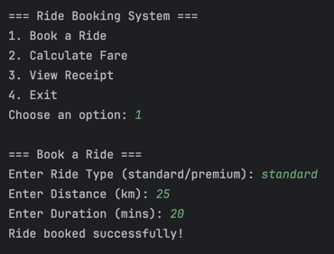
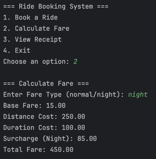
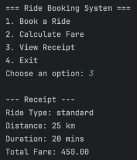
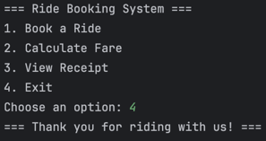

# Lab 3: Java OOP Capstone Project

## Ride Fare Calculator

This project is a simple ride fare calculator that allows users to book rides, calculate fares, and view receipts. It is built using Java and demonstrates the principles of Object-Oriented Programming (OOP).

### Project structure

```
src/main/java/org/example/
├── Main.java
├── basefare/
│   ├── PremiumRide.java
│   ├── RideTypeFactory.java
│   ├── RideTypeStrategy.java
│   └── StandardRide.java
└── surcharge/
    ├── FareTypeFactory.java
    ├── FareTypeStrategy.java
    ├── NightFare.java
    └── NormalFare.java
```

### Features

1. **Book a Ride**

   - This feature allows users to book a ride by entering their ride type, distance, and time. The application will then book the ride.  
   - 

2. **Calculate Fare**

   - After booking a ride, users can calculate the fare based on the distance and time entered. The application will prompt the user to enter the fare type to compute for additional surcharges. The breakdown of the fare will be displayed to the user.
   - 

3. **View Receipt**

    - Users can view the receipt of their ride, which includes the ride details and total amount. The receipt will be displayed in a formatted manner.
    - 

4. **Exit**

    - Users can exit the application at any time.
    - 

### Members

- **Warren Denzel Cheng**
- **Godfrey Angelo Convento**
- **Jahren Hans Dayag**
